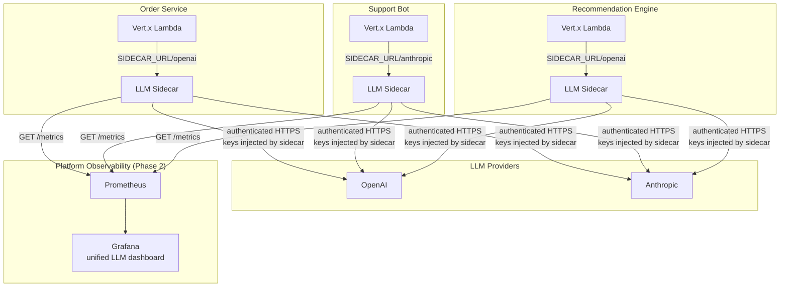
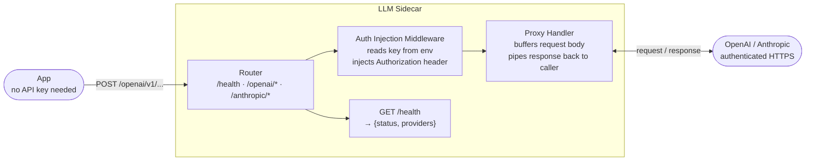
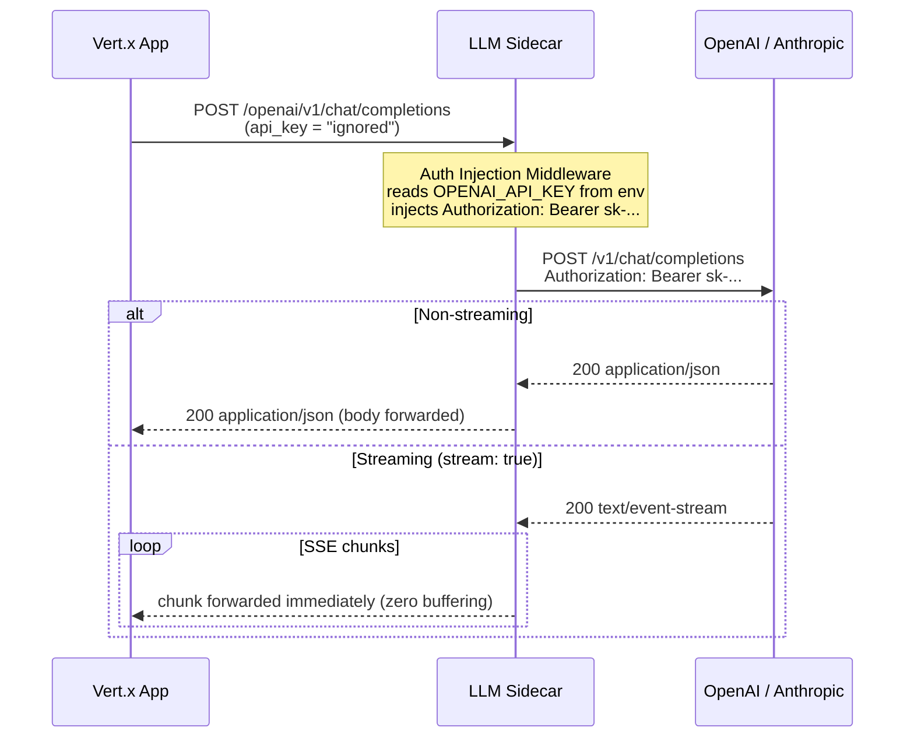
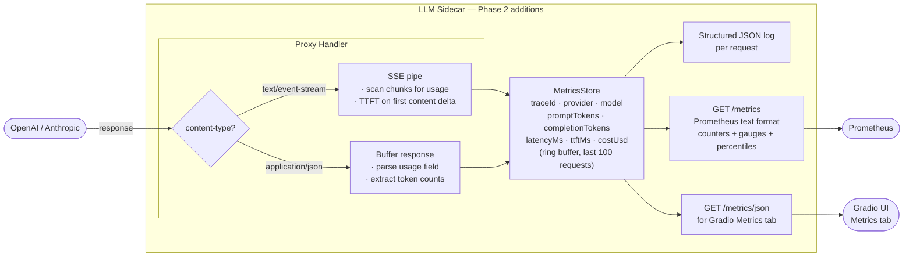
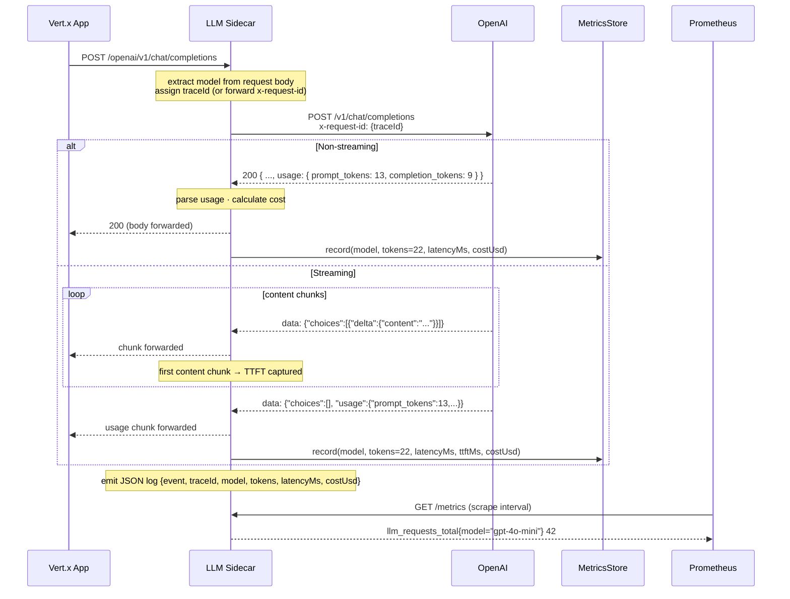
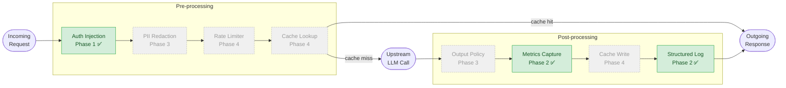
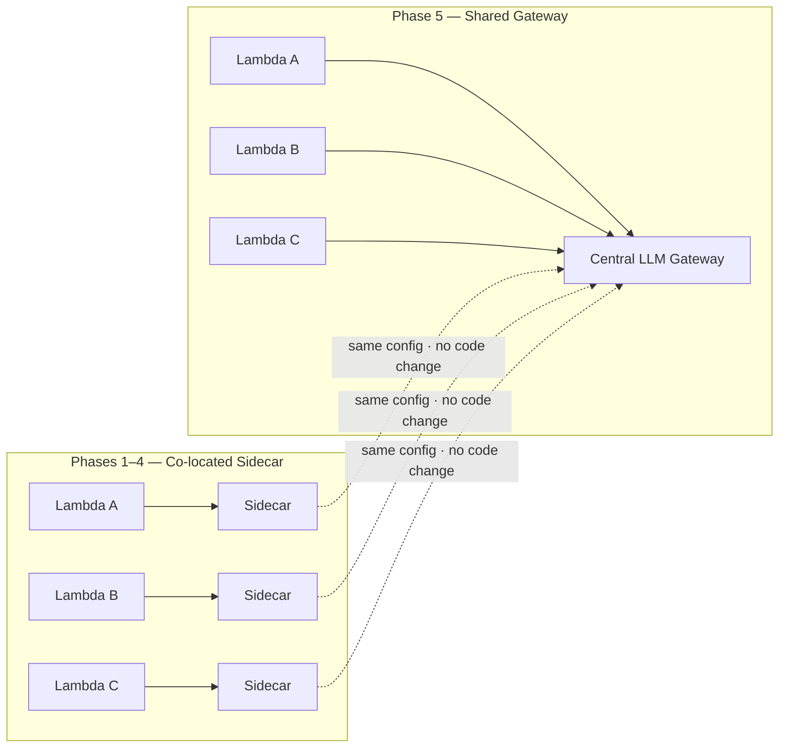

# LLM Sidecar — Architecture

## Motivation

Enterprise teams building LLM features face the same cross-cutting concerns repeatedly:
**who called what model, at what cost, with what data, and did it comply with policy?**

Without a sidecar, each team solves this independently — inconsistent observability, keys
scattered across services, no shared safety layer, and no ability to enforce org-wide spend
controls. The sidecar moves these concerns out of application code and into infrastructure,
one phase at a time.

---

## Enterprise Overview

Three teams. Three co-located sidecars. One shared observability stack.
No team handles API keys, logging, or cost tracking directly.

---

## Phase 1 — Transparent Proxy ✅

**What it adds:** routing, auth injection, streaming passthrough, health endpoint.

Teams change one env var (`SIDECAR_URL`). The sidecar reads API keys from the
environment and injects them — keys never touch application code.

### Component View

### Request Flow

---

## Phase 2 — Observability ✅  *(current)*

**What it adds:** token tracking, cost estimation, latency + TTFT metrics,
structured JSON logs, `/metrics` (Prometheus), `/metrics/json` (Gradio UI).

The proxy handler branches on response type to capture metrics without breaking the
streaming pipeline. For SSE, it scans chunks in-flight; for JSON it buffers once to
parse the `usage` field.

### Metrics Capture Pipeline

### Observability Flow

---

## Middleware Pipeline — All Phases

Active phases (✅) are highlighted. Planned phases are greyed out.

---

## Sidecar → Gateway Evolution

As adoption grows, the co-located sidecar can be promoted to a shared gateway without
touching any Lambda application code — the middleware pipeline, config schema, and
provider abstractions remain identical.

The gateway adds: centralized key vault, cross-team budget enforcement, unified audit
trail, and a management API — without touching any Lambda application code.

---

## What Each Role Owns

| Role | Responsibility |
|---|---|
| **Application team** | Business logic, prompt design, model selection hint |
| **Sidecar / Gateway** | Auth, observability, safety, rate limiting, caching, routing |
| **Platform team** | Sidecar deployment, config policy, provider contracts, dashboards |
