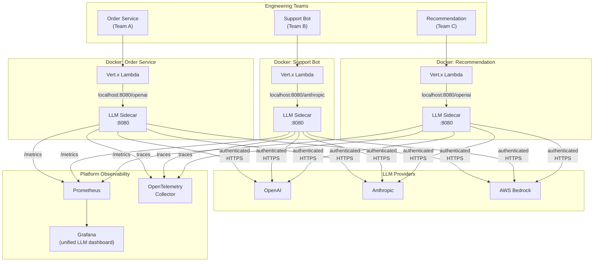
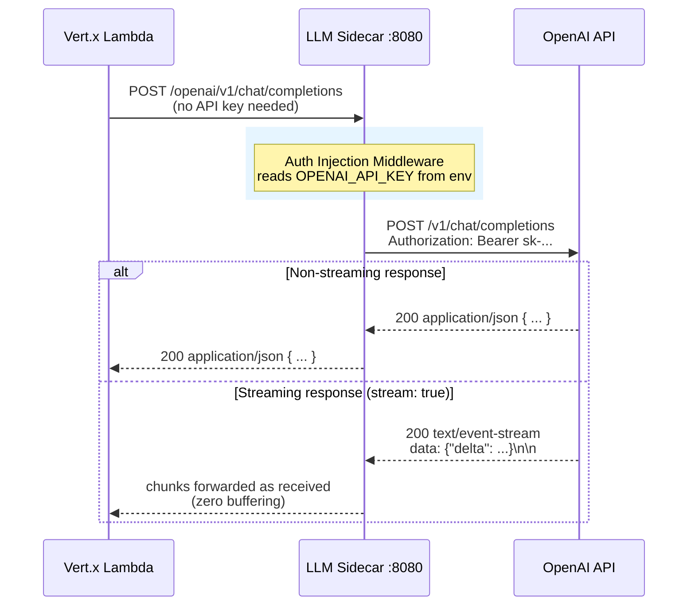
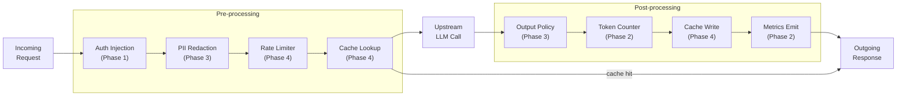
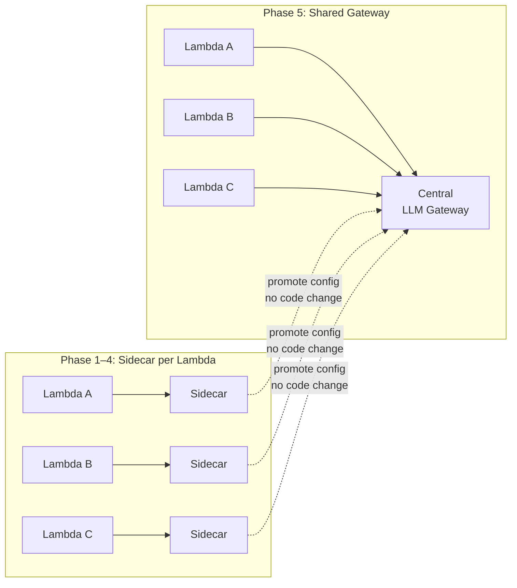

# LLM Sidecar — Architecture

## Motivation

Enterprise teams building LLM features face the same cross-cutting concerns repeatedly:
**Who called what model, at what cost, with what data, and did it comply with policy?**

Without a sidecar, each team solves this independently — inconsistent observability, keys
scattered across services, no shared safety layer, and no ability to enforce org-wide spend
controls. The sidecar moves these concerns out of application code and into infrastructure.

---

## Enterprise Context

---

## Request Flow (Phase 1)

---

## Middleware Pipeline (all phases)

---

## Sidecar → Gateway Evolution

As adoption grows, the per-Lambda sidecar can be promoted to a shared gateway. The
middleware pipeline, config schema, and provider abstractions remain identical — only
the deployment topology changes.

The gateway adds: centralized key vault, cross-team budget enforcement, unified audit
trail, and a management API — without touching any Lambda application code.

---

## What Each Role Owns

| Role | Responsibility |
|---|---|
| **Application team** | Business logic, prompt design, model selection hint |
| **Sidecar / Gateway** | Auth, observability, safety, rate limiting, caching, routing |
| **Platform team** | Sidecar deployment, config policy, provider contracts, dashboards |
